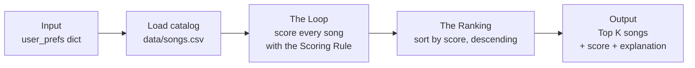

# 🎵 Music Recommender Simulation

## Project Summary

In this project you will build and explain a small music recommender system.

Your goal is to:

- Represent songs and a user "taste profile" as data
- Design a scoring rule that turns that data into recommendations
- Evaluate what your system gets right and wrong
- Reflect on how this mirrors real world AI recommenders

Replace this paragraph with your own summary of what your version does.

---

## How The System Works

### How real platforms do it

Big platforms like Spotify and TikTok predict what you'll love next by combining two main strategies. **Collaborative filtering** looks at *other users' behavior*: if people who like the same songs as you also love a track you haven't heard, it gets recommended — no knowledge of the music itself is needed. **Content-based filtering** looks at *the attributes of the songs themselves*: genre, mood, tempo, energy, and audio features extracted from the actual track. If you keep playing chill low-tempo lofi, the system recommends more songs whose features look like that. Real systems feed both approaches with signals like likes, skips, replays, playlist adds, listening time, and audio analysis, then blend them with machine learning at massive scale.

My version is a **content-based recommender**: it has no other users to learn from, so it scores each song purely on how well its attributes match one user's stated taste profile. It prioritizes genre match first (the strongest taste signal), then mood, then how *close* the song's energy is to the user's ideal — not just high or low energy, but the right amount.

### Features my objects use

Each `Song` uses:

- `genre` (categorical — e.g. pop, lofi, rock)
- `mood` (categorical — e.g. happy, chill, intense)
- `energy` (0.0–1.0)
- `acousticness` (0.0–1.0)
- plus `tempo_bpm`, `valence`, and `danceability` are available in the data for experiments

Each `UserProfile` stores:

- `favorite_genre` — the genre the user gravitates toward
- `favorite_mood` — the vibe they want right now
- `target_energy` — their ideal energy level (0.0–1.0)
- `likes_acoustic` — whether they prefer acoustic-sounding tracks

### The Dataset

The catalog (`data/songs.csv`) holds 20 songs spanning 15 genres (pop, lofi, rock, ambient, jazz, synthwave, indie pop, hip hop, country, classical, edm, folk, metal, r&b, reggae, latin) and 12 moods (happy, chill, intense, relaxed, moody, focused, confident, nostalgic, melancholy, energetic, romantic, angry, sad). Numerical features stay on a 0.0–1.0 scale (except `tempo_bpm`) and were chosen to be internally consistent — e.g. the metal track has near-max energy and near-zero acousticness, the classical piece is the opposite.

### The User Profile

The demo taste profile the recommender will run against:

```python
user_prefs = {
    "favorite_genre": "lofi",
    "favorite_mood": "chill",
    "target_energy": 0.35,
    "likes_acoustic": True,
}
```

**Can this profile differentiate "intense rock" from "chill lofi"?** Yes — checked against the catalog: *Storm Runner* (rock, intense, energy 0.91) misses on genre, misses on mood, and its energy is 0.56 away from the target, so it scores near zero. *Midnight Coding* (lofi, chill, energy 0.42) hits genre, hits mood, and is only 0.07 off on energy, scoring near the maximum. The gap between the best and worst match is wide, so the profile is discriminative.

**Is it too narrow?** Somewhat, by design — all four preferences point at the same low-key vibe, which makes the filter-bubble risk easy to observe. But the energy-closeness and acoustic terms let near-miss songs surface: *Coffee Shop Stories* (jazz, relaxed, energy 0.37, acousticness 0.89) matches on zero categorical features yet still earns real points, which proves the system isn't purely genre-locked.

### My Algorithm Recipe (finalized)

**Scoring Rule** (computes one number for one song):

- Genre matches the user's favorite: **+2.0** (weighted highest — genre is the strongest predictor of taste)
- Mood matches: **+1.0**
- Energy closeness: **+1.5 × (1 − |target_energy − song energy|)** — this rewards songs *near* the user's ideal energy instead of just favoring the highest or lowest values
- Acoustic bonus: **+0.5** if the user likes acoustic and the song's acousticness is high

**Ranking Rule** (turns scores into recommendations): score every song in the catalog, sort descending by score, and return the top *k*.

We need both rules because they answer different questions. The scoring rule evaluates a single song in isolation — "how well does this one song fit this user?" — but a score by itself is meaningless without context (is 3.5 good?). The ranking rule compares scores *across* the whole catalog to decide which songs are the best available options. Scoring turns data into numbers; ranking turns numbers into a recommendation list.

### Data Flow



In words: the user profile comes in, `load_songs` reads the CSV into song dictionaries, `score_song` judges each song one at a time against the profile (producing a score and the reasons behind it), and `recommend_songs` sorts all scored songs and returns the top *k* with explanations.

### Biases I Expect

- **Genre over-prioritization.** At +2.0, a genre match alone outscores a perfect mood match (+1.0). A mediocre lofi track can beat a jazz track that fits the user's mood and energy perfectly — great songs get ignored for having the "wrong" label.
- **Filter bubble.** The system only recommends what already resembles the profile. A lofi-chill user will never be shown *Cumbia Sunrise* or *Iron Choir*, so their profile never gets the chance to broaden — the loop reinforces itself.
- **Exact-string matching is brittle.** "indie pop" ≠ "pop" and "relaxed" ≠ "chill" to this system, even though humans would call them neighbors. Genres with many near-synonyms get unfairly fragmented.
- **Catalog imbalance.** Lofi has 3 of the 20 songs while metal, reggae, and latin have 1 each — genres with more entries simply have more chances to appear in any top-5 list.

---

## Getting Started

### Setup

1. Create a virtual environment (optional but recommended):

   ```bash
   python -m venv .venv
   source .venv/bin/activate      # Mac or Linux
   .venv\Scripts\activate         # Windows

2. Install dependencies

```bash
pip install -r requirements.txt
```

3. Run the app:

```bash
python -m src.main
```

### Running Tests

Run the starter tests with:

```bash
pytest
```

You can add more tests in `tests/test_recommender.py`.

---

## Sample Recommendation Output

Output of `python -m src.main` with the default pop/happy profile:

```
Loaded songs: 20
User profile: genre=pop, mood=happy, energy=0.8, acoustic=False

Top recommendations:

1. Sunrise City — Neon Echo  [score: 4.47]
   because: genre match: pop (+2.0); mood match: happy (+1.0); energy 0.82 vs target 0.80 (+1.47)

2. Gym Hero — Max Pulse  [score: 3.30]
   because: genre match: pop (+2.0); energy 0.93 vs target 0.80 (+1.30)

3. Rooftop Lights — Indigo Parade  [score: 2.44]
   because: mood match: happy (+1.0); energy 0.76 vs target 0.80 (+1.44)

4. Night Drive Loop — Neon Echo  [score: 1.42]
   because: energy 0.75 vs target 0.80 (+1.42)

5. Cumbia Sunrise — Rio Bloom  [score: 1.41]
   because: energy 0.86 vs target 0.80 (+1.41)
```

**Screenshot or video** *(optional)*: <!-- Insert a screenshot or demo video link here -->

---

## Experiments You Tried

**Stress test: five user profiles.** I ran the recommender against three realistic profiles (High-Energy Pop, Chill Lofi, Deep Intense Rock) and two adversarial ones (a "conflicted" user wanting sad mood at 0.9 energy, and a k-pop fan whose genre isn't in the catalog). Full outputs and pairwise comparisons are in [model_card.md](model_card.md#7-evaluation). Highlights: the pop and lofi profiles share zero songs (clean separation), the conflicted user's sad preference mostly loses to the energy term, and the k-pop user gets confident-looking recommendations built entirely on energy math.

**Weight shift: energy 1.5 → 3.0, genre 2.0 → 1.0.** For all three realistic profiles the top-5 *order didn't change at all* — only the score gaps compressed, because those users' genre, mood, and energy preferences all point at the same songs anyway. But the conflicted profile flipped: *Rainy Platform* (the catalog's only sad song, and that user's only mood match) dropped out of the top 5, replaced by *Cumbia Sunrise* and *Iron Choir* on raw energy alone. Conclusion: weights are nearly irrelevant for coherent users and completely decisive for conflicted ones — and this particular change made results different, not more accurate, so I reverted to the original weights.

**Observation without a code change: the energy floor.** Because every song earns energy-closeness points, a song with zero categorical matches can still make a top-5 list (e.g. *Cumbia Sunrise* for both the pop and rock fans). This is a scoring-design bias, not a bug — documented in the model card's Limitations section.

---

## Limitations and Risks

Summarize some limitations of your recommender.

Examples:

- It only works on a tiny catalog
- It does not understand lyrics or language
- It might over favor one genre or mood

You will go deeper on this in your model card.

---

## Reflection

Read and complete `model_card.md`:

[**Model Card**](model_card.md)

Write 1 to 2 paragraphs here about what you learned:

- about how recommenders turn data into predictions
- about where bias or unfairness could show up in systems like this


